 
* Required packages

```{r setup, include=TRUE}
knitr::opts_chunk$set(echo = TRUE)
#install.packages("dplyr","ade4","magrittr","cluster","factoextra","cluster.datasets","xtable","kableExtra","knitr","summarytools")
knitr::opts_chunk$set(echo = TRUE)
```


# Definition of a distance

* A distance function or a metric on $\mathbb{R}^m,\:m\geq 1$, is a function $d:\mathbb{R}^m\times\mathbb{R}^m\rightarrow \mathbb{R}$.
* A distance function must satisfy some required properties or axioms. 
* There are three main axioms.
* A1. $d(\mathbf{x},\mathbf{y})= 0\iff \mathbf{x}=\mathbf{y}$ (identity of indiscernibles);
* A2. $d(\mathbf{x},\mathbf{y})= d(\mathbf{y},\mathbf{x})$ (symmetry);

* A3. $d(\mathbf{x},\mathbf{z})\leq d(\mathbf{x},\mathbf{y})+d(\mathbf{y},\mathbf{z})$  (triangle inequality),
where $\mathbf{x}=(x_1,\cdots,x_m)$, $\mathbf{y}=(y_1,\cdots,y_m)$ and $\mathbf{z}=(z_1,\cdots,z_m)$ are all vectors of $\mathbb{R}^m$.
* We should use the term _dissimilarity_ rather than _distance_ when not all the three axioms A1-A3 are valid.
* Most of the time, we shall use, with some abuse of vocabulary, the term distance.

# Exercice 1

* Prove that the three axioms A1-A3 imply the non-negativity condition: $$d(\mathbf{x},\mathbf{y})\geq 0.$$


# Euclidean distance

* It is defined by:

$$
d(\mathbf{x},\mathbf{y})=\sqrt{\sum_{j=1}^m (x_j-y_j)^2}.
$$

* A1-A2 are obvious.
* The proof of A3 is provided below.

# Exercice 2

* Is the squared Euclidian distance a true distance?

# Manhattan distance

* The Manhattan distance also called  taxi-cab metric or city-block metric is defined by:

$$d(\mathbf{x},\mathbf{y})
=\sum_{j=1}^m |x_j-y_j|.$$

* A1-A2 hold.
* A3 also holds using the fact that $|a+b|\leq |a|+|b|$ for any reals $a,b$.
* There exists also a weighted version  of the Manhattan distance called the Canberra distance.


```{r}
x = c(0, 0)
y = c(6,6)
dist(rbind(x, y), method = "euclidian")
dist(rbind(x, y), method = "euclidian",diag=T,upper=T)
6*sqrt(2)
dist(rbind(x, y), method = "manhattan")
dist(rbind(x, y), method = "manhattan",diag=T,upper=T)

```

# Canberra distance

* It is defined by:

$$d(\mathbf{x},\mathbf{y})
=\sum_{j=1}^m
 \frac{|x_j-y_j|}{|x_j|+|y_j|}.$$

* Note that the term $|x_j-y_j|/(|x_j|+|y_j|)$ is not properly defined as: $x_j=y_j=0$.
* By convention we set that term to be zero in that case.
* The Canberra distance is specially sensitive to small changes near zero.

```{r}
x = c(0, 0)
y = c(6,6)
dist(rbind(x, y), method = "canberra")
6/6+6/6
```

# Exercice 3

* Prove that the Canberra distance is a true distance, i.e. that it satisfies A1-A3.

# Minkowski distance
* Both the Euclidian and the Manattan distances are special cases of  the Minkowski distance which is defined, for $p\geq 1$, by: 
$$
d(\mathbf{x},\mathbf{y})=
\left[\sum_{j=1} |x_j-y_j|^{p}\right]^{1/p}.
$$
 * For $p=1$, we get the Manhattan distance.
 * For $p=2$, we get the Euclidian distance.
* Let us also define: 
$$\|\mathbf{x}\|_p\equiv\left[\sum_{j=1}^m |x_j|^{p}\right]^{1/p},$$
where $\|\mathbf{\cdot}\|_p$ is known as the $p$-norm or Minkowski norm.
* Note that the Minkowski distance and norm are related by:

$$d(\mathbf{x},\mathbf{y})=\|\mathbf{x}-\mathbf{y}\|_p.$$

* Conversely, we have:

$$\|\mathbf{x}\|_p=d(\mathbf{x},\mathbf{0}),$$

where 
$\mathbf{0}$ is the null-vetor of $\mathbb{R}^m$.

```{r}
library("ggplot2")
x = c(0, 0)
y = c(6,6)
MinkowDist=c() # Initialiser à vide la liste
for (p in seq(1,30,.01))
{
MinkowDist=c(MinkowDist,dist(rbind(x, y), method = "minkowski", p = p))     
}

ggplot(data =data.frame(x = seq(1,30,.01), y=MinkowDist ) , mapping = aes( x=x, y= y))+
  geom_point(size=.1,color="red")+
  xlab("p")+ylab("Minkowski Distance")+ggtitle("Minkowski distance wrt p")
```

# Exercice 4

Produce a similar graph using "The Economist" theme. Indicate on the graph the Manhattan, the Euclidian distances as well as the Chebyshev distance introduced below.

# Chebyshev distance 

* At the limit, we get the Chebyshev distance which is defined by:
$$
d(\mathbf{x},\mathbf{y})=\max_{j=1,\cdots,n}(|x_j-y_j|)=\lim_{p\rightarrow\infty}
\left[\sum_{j=1} |x_j-y_j|^{p}\right]^{1/p}.
$$

* The corresponding norm is:

$$
\|\mathbf{x}\|_\infty=\max_{j=1,\cdots,n}(|x_j|).
$$

# Minkowski inequality

* The proof of the triangular inequality A3 is based on the Minkowski inequality:
* For any nonnegative real numbers $a_1,\cdots,a_m$; $b_1,\cdots,b_m$, and for any $p\geq 1$, we have:
$$
\left[\sum_{j=1}^m (a_j+b_j)^{p}\right]^{1/p}\leq
\left[\sum_{j=1}^m a_j^{p}\right]^{1/p}
+\left[\sum_{j=1}^m b_j^{p}\right]^{1/p}.
$$
* To prove that the Minkowski distance satisfies A3, notice that 
$$
 \sum_{j=1}^m|x_j-z_j|^{p}= \sum_{j=1}^m|(x_j-y_j)+(y_j-z_j)|^{p}.
$$
* Since for any reals $x,y$, we have: $|x+y|\leq |x|+|y|$, and using the fact that $x^p$ is increasing in $x\geq 0$, we obtain:
$$
 \sum_{j=1}^m|x_j-z_j|^{p}\leq \sum_{j=1}^m(|x_j-y_j|+|y_j-z_j|)^{p}.
$$

* Applying the Minkowski inequality with $a_j=|x_j-y_j|$ and $b_j=|y_j-z_j|$, $j=1,\cdots,n$, we get:
$$
 \sum_{j=1}^m|x_j-z_j|^{p}\leq \left(\sum_{j=1}^m |x_j-y_j|^{p}\right)^{1/p}+\left(\sum_{j=1}^m |y_j-z_j|^{p}\right)^{1/p}.
$$

# Exercice 5
To illustrate the Minkowski inequality, draw $100$ times two lists of $100$ draws from the lognormal distribution with mean $1600$ and standard-deviation $300$. Illustrate with a graph the gap between the two drawn lists.

# Hölder inequality

* The proof of the Minkowski inequality itself requires the Hölder inequality:
* For any nonnegative real numbers $a_1,\cdots,a_m$; $b_1,\cdots,b_m$, and any $p,q>1$ with $1/p+1/q=1$, we have:
$$
\sum_{j=1}^m a_jb_j\leq
\left[\sum_{j=1}^m a_j^{p}\right]^{1/p}
\left[\sum_{j=1}^m b_j^{q}\right]^{1/q}
$$
* The proof of the Hölder inequality relies on the Young inequality:
* For any $a,b>0$, we have
$$
ab\leq \frac{a^p}{p}+\frac{b^q}{q},
$$
with equality occuring iff: $a^p=b^q$. 
* To prove the Young inequality, one can use the (strict) convexity of the exponential function.
* For any reals $x,y$, we have:
$$
e^{\frac{x}{p}+\frac{y}{q} }\leq \frac{e^{x}}{p}+\frac{e^{y}}{q}. 
$$
* We then set: $x=p\ln a$ and $y=q\ln b$ to get the Young inequality.
* A good reference on inequalities is: [Z. Cvetkovski,  Inequalities: theorems, techniques and selected problems, 2012, Springer Science & Business Media](https://book4you.org/book/1228394/3ec0fb).

 # Cauchy-Schwartz inequality

* Note that the triangular inequality for the Minkowski distance implies: 
$$
\sum_{j=1}^m |x_j|\leq
\left[\sum_{j=1}^m |x_j|^{p}\right]^{1/p}.
$$
* Note that for $p=2$, we have $q=2$. The Hölder inequality implies for that special case
$$
\sum_{j=1}^m|x_jy_j|\leq\sqrt{\sum_{j=1}^m x_j^2}\sqrt{\sum_{j=1}^m y_j^2}. 
$$
* Since the LHS od thes above inequality is greater then $|\sum_{j=1}^mx_jy_j|$, we get the Cauchy-Schwartz inequality
$$
|\sum_{j=1}^mx_jy_j|\leq\sqrt{\sum_{j=1}^m x_j^2}\sqrt{\sum_{j=1}^m y_j^2}. 
$$
* Using the dot product notation called also scalar product notation: $\mathbf{x\cdot y}=\sum_{j=1}^mx_jy_j$, and the norm notation $\|\mathbf{\cdot}\|_2$, the Cauchy-Schwartz inequality is:
$$
|\mathbf{x\cdot y} | \leq \|\mathbf{x}\|_2 \| \mathbf{y}\|_2.
$$


# Pearson correlation distance 

* The Pearson correlation coefficient is a similarity measure on $\mathbb{R}^m$ defined by:
$$
\rho(\mathbf{x},\mathbf{y})=
\frac{\sum_{j=1}^m (x_j-\bar{\mathbf{x}})(y_j-\bar{\mathbf{y}})}{{\sqrt{\sum_{j=1}^m (x_j-\bar{\mathbf{x}})^2\sum_{j=1}^m (y_j-\bar{\mathbf{y}})^2}}},
$$
where $\bar{\mathbf{x}}$ is the mean of the vector $\mathbf{x}$ defined by: 
$$\bar{\mathbf{x}}=\frac{1}{n}\sum_{j=1}^m x_j,$$
* Note that the Pearson correlation coefficient satisfies P2 and  is invariant to any positive linear transformation, i.e.: $$\rho(\alpha\mathbf{x},\mathbf{y})=\rho(\mathbf{x},\mathbf{y}),$$ for any $\alpha>0$.
* The Pearson distance (or correlation distance) is defined by:
$$
d(\mathbf{x},\mathbf{y})=1-\rho(\mathbf{x},\mathbf{y}).
$$

* Note that the Pearson distance does not satisfy A1 since $d(\mathbf{x},\mathbf{x})=0$ for any non-zero vector $\mathbf{x}$. It neither satisfies the triangle inequality. However, the symmetry property is fullfilled. 

# Cosine correlation distance

* The cosine of the angle $\theta$ between two vectors $\mathbf{x}$ and $\mathbf{y}$ is a measure of similarity given by:
$$
\cos(\theta)=\frac{\mathbf{x}\cdot \mathbf{y}}{\|\mathbf{x}\|_2\|\mathbf{y}\|_2}=\frac{\sum_{j=1}^m x_j y_j}{{\sqrt{\sum_{j=1}^m x_j^2\sum_{j=1}^m y_j^2}}}.
$$
* Note that the cosine of the angle between the two centred vectors $\mathbf{x}-\bar{\mathbf{x}}\mathbf{1}$ and $\mathbf{y}-\bar{\mathbf{y}}\mathbf{1}$ coincides with the Pearson correlation coefficient of $\mathbf{x}$ and $\mathbf{y}$, where $\mathbf{1}$ is a vector of units of $\mathbb{R}^m$.
* The cosine correlation distance is defined by:
$$
d(\mathbf{x},\mathbf{y})=1-\cos(\theta).
$$
* It shares similar properties than the Pearson correlation distance. Likewise, Axioms A1 and A3 are not satisfied.


# Spearman correlation distance 

* To calculate the Spearman's rank-order correlation, we need to map seperately each of the vectors to ranked data values: 
$$\mathbf{x}\rightarrow \text{rank}(\mathbf{x})=(x_1^r,\cdots,x_m^r).$$
* Here, $x_j^r$ is the rank of $x_j$ among the set of values of $\mathbf{x}$.
* We illustrate this transformation with a simple example:
* If $\mathbf{x}=(3, 1, 4, 15, 92)$, then the rank-order vector is $\text{rank}(\mathbf{x})=(2,1,3,4,5)$.  

```{r}
x=c(3, 1, 4, 15, 92)
rank(x)
```

* The Spearman's rank correlation of two numerical vectors $\mathbf{x}$  and $\mathbf{y}$ is simply the Pearson correlation of the two correspnding rank-order vectors $\text{rank}(\mathbf{x})$ and $\text{rank}(\mathbf{y})$, i.e. $\rho(\text{rank}(\mathbf{x}),\text{rank}(\mathbf{y}))$. This measure is is useful because it is more robust against outliers than the Pearson correlation.
* If all  the $n$  ranks are distinct, it can be computed using the following formula:
$$
\rho(\text{rank}(\mathbf{x}),\text{rank}(\mathbf{y}))=1-\frac{6\sum_{j=1}^m d_j^2}{n(n^2-1)},
$$
where $d_j=x_j^r-y_j^r,\:j=1,\cdots,n$.
 * The spearman distance is then defined by:
$$
d(\mathbf{x},\mathbf{y})=1-\rho(\text{rank}(\mathbf{x}),\text{rank}(\mathbf{y})).
$$
* It can be shown that easaly that it is not a proper distance.
* If all  the $n$  ranks are distinct, we get:
$$
d(\mathbf{x},\mathbf{y})=\frac{6\sum_{j=1}^m d_j^2}{n(n^2-1)}.
$$


```{r}
x=c(3, 1, 4, 15, 92)
rank(x)
y=c(30,2 , 9, 20, 48)
rank(y)
d=rank(x)-rank(y)
d
cor(rank(x),rank(y))
1-6*sum(d^2)/(5*(5^2-1))
```


# Exercice 6
* For the two vectors $\mathbf{x}=(22,34,1,12,25,56,7)$ and $\mathbf{y}=(2,64,12,2,22,5,8)$ :
* Calculate the ranks for each vector.
* Deduce the Spearman correlation distance from that ranks.
* Deduce the Spearman correlation distance from the above dispalyed alternative equation.
* Calculate the Spearman correlation distance using the **R** function. 

# Kendall tau distance 

* The Kendall rank correlation coefficient is calculated from the number of correspondances between the rankings of $\mathbf{x}$ and the rankings of $\mathbf{y}$.
*   The number of pairs of observations among $n$ observations or values is: 
$${n \choose 2} =\frac{n(n-1)}{2}.$$
* The pairs of observations $(x_{i},x_{j})$  and  $(y_{i},y_{j})$ are said to be _concordant_ if: $$\text{sign}(x_j-x_j)=\text{sign}(y_j-y_j),$$ and to be _discordant_ if:  $$\text{sign}(x_j-x_j)=-\text{sign}(y_j-y_j),$$
where $\text{sign}(\cdot)$ returns  $1$ for positive numbers and  $-1$ negative numbers and $0$ otherwise.
* If $x_j=x_j$ or $y_j=y_j$ (or both), there is a tie.
* The Kendall $\tau$ coefficient is defined by (neglecting ties):
$$\tau =\frac {1}{n(n-1)}\sum_{j=1}^{n}\sum_{j=1}^m\text{sign}(x_j-x_j)\text{sign}(y_j-y_j).$$
* Let $n_c$ (resp. $n_d$) be the number of concordant (resp. discordant) pairs, we have $$\tau =\frac {2(n_c-n_d)}{n(n-1)}.$$ 
* The Kendall tau distance is then: $$d(\mathbf{x},\mathbf{y})=1-\tau. $$
* Remark: the triangular inequality may fail in cases where there are ties.


```{r}
x=c(3, 1, 4, 15, 92)
y=c(30,2 , 9, 20, 48)
tau=0
for (i in 1:5)
{  
tau=tau+sign(x -x[i])%*%sign(y -y[i])
}
tau=tau/(5*4)
tau
cor(x,y, method="kendall")
```

# Exercice 7
* For the two vectors $\mathbf{x}=(22,34,1,12,25,56,7)$ and $\mathbf{y}=(2,64,12,2,22,5,8)$ :
* List all pairs of coordinates.
* How many pairs are there?
* For each pair and each cector, compute the signs of the differences in coordinates.
* Deduce the Kendall tau coefficient using the above computations.
* Calculate the Kendall tau coefficient using the R function. 

# Standardization

* Variables or measurements are often standardized before calculating dissimilarities.
* Standardization converts the original variables into uniteless variables.
* A well known method is the z-score transformation.
* Let $\mathbf{v}\equiv (v_1,\cdots,v_n )$ a vector of measurements recrded for $n$ individuals or objects. 
$$
\mathbf{v}\rightarrow (\frac{v_1-\bar{\mathbf{v}}}{s_\mathbf{v}},\cdots,\frac{v_n-\bar{\mathbf{v}}}{s_\mathbf{v}}),
$$ 
where $\bar{\mathbf{v}},s_\mathbf{v}$ are the sample mean and standard-deviation, respectively,  given by:
$$
\bar{\mathbf{v}}=\frac{1}{n}\sum_{i=1}^n v_i,\:
s_\mathbf{v}=\frac{1}{n-1}\sum_{i=1}^n(v_i-\bar{\mathbf{v}})^2.
$$
* The transformed variable will have a mean of $0$ and a variance of $1$.
* The result obtained with Pearson correlation measures and standardized Euclidean distances are comparable.
* For other methods, see: [Milligan, G. W., & Cooper, M. C. (1988). A study of standardization of variables in cluster analysis. _Journal of classification_, _5_(2), 181-204](https://booksc.org/book/6755563/66358a)

```{r}
v=c(3, 1, 4, 15, 92)
w=c(30,2 , 9, 20, 48)
(v-mean(v))/sd(v)
scale(v)
(w-mean(w))/sd(w)
scale(w)
```


# Exercice 8

* Consider the following example 
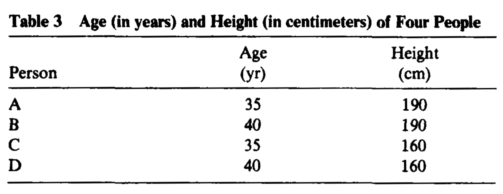

* Plot the data using a nice scatter plot.
* Transform the Height from centimeters (cm) into feet (ft).
* Display your data in a table. 
* Plot the data within a new scatter plot.
* What do you observe?
* Standardize the two variables Age and Height.
* Display your data in a table.
* Plot the standardized data within a new scatter plot.
* Conclude.


# Similarity measures for binary data
* A common simple situation occurs when all information is of the presence/absence of 2-level qualitative characters.
* We assume there are $n$ characters.
* *The presence of the character is coded by $1$ and the absence by 0. 
* We have have at our disposal two vectors.
* $\mathbf{x}$ is observed for a first individual (or object).
* $\mathbf{y}$ is observed for a second individual. 
* We can then calculate the following four statistics:
 
   $a=\mathbf{x\cdot y}=\sum_{j=1}^mx_jy_j.$
   
   $b=\mathbf{x\cdot (1-y)}=\sum_{j=1}^mx_j(1-y_j).$
   
   $c=\mathbf{(1-x)\cdot y}=\sum_{j=1}^m(1-x_j)y_j.$

   $d=\mathbf{(1-x)\cdot (1-y)}=\sum_{j=1}^m(1-x_j)(1-y_j).$

* The counts of  matches are $a$ for $(1,1)$ and $d$ for $(0,0)$;
* The counts of mismatches are $b$ for $(1,0)$ and $c$ for $(0,1)$.
* Note that obviously: $a+b+c+d= n$.
* This gives a very useful $2 \times 2$ association table. 


|    |    |Second individual|||
|:---|---|:---:|:---:|:---:|
|  |    |1  |0|*Totals*
|**First individual**|1|$a$|$b$|$a+b$|
|             |0|$c$|$d$|$c+d$|
|*Totals*||$a+c$|$b+d$|$n$|


Table from [Kaufman, L., & Rousseeuw, P. J. (2009). Finding groups in data: an introduction to cluster analysis (Vol. 344). John Wiley & Sons](https://book4you.org/book/669277/d2cf59)


* The data shows $8$ people (individuals) and $10$ binary variables:
* Sex, Married, Fair Hair, Blue Eyes, Wears Glasses, Round Face, Pessimist, Evening Type, Is an Only Child, Left-Handed.

```{r}
data=c(
1,0,1,1,0,0,1,0,0,0,
0,1,0,0,1,0,0,0,0,0,
0,0,1,0,0,0,1,0,0,1,
0,1,0,0,0,0,0,1,1,0,
1,1,0,0,1,1,0,1,1,0,
1,1,0,0,1,0,1,1,0,0,
0,0,0,1,0,1,0,0,0,0,
0,0,0,1,0,1,0,0,0,0
)
data=data.frame(matrix(data, nrow=8,byrow=T))
row.names(data)=c("Ilan","Jacqueline","Kim","Lieve","Leon","Peter","Talia","Tina")
names(data)=c("Sex", "Married", "Fair Hair", "Blue Eyes", "Wears Glasses", "Round Face", "Pessimist", "Evening Type", "Is an Only Child", "Left-Handed")
```

* We are comparing the records for Ilan with Talia.

```{r, echo=TRUE,results='asis',message=FALSE}
library(knitr)
library(xtable)
library(stargazer)
library(texreg)
library(kableExtra)
library(summarytools)

set.seed(893)
datat<-as.data.frame(t(data))
datat=lapply(datat,as.factor)
Ilan=datat$Ilan
Talia =datat$Talia
print(ctable(Ilan,Talia,prop = 'n',style = "rmarkdown"))

```


* Therefore: $a = 1,\:b = 3,\: c = 1,\: d = 5$.
* Note that interchanging Ilan and Talia would permute $b$ and $c$ while leaving $a$ and $d$ unchanged.
* A good similarity or dissimilarity coefficient must treat $b$ and $c$ symmetrically.
* A similarity measure is denoted by: $s(\mathbf{x},\mathbf{y})$.
* The corresponding distance is then defined as: 
 $$d(\mathbf{x},\mathbf{y})=1-s(\mathbf{x},\mathbf{y}).$$
* Alternatively, we have:
$$d(\mathbf{x},\mathbf{y})=\sqrt{1-s(\mathbf{x},\mathbf{y})}.$$ 
* A list of some of the similarity measures $s(\mathbf{x},\mathbf{y})$ that have been suggested for binary data is shown below.
* An more complete list can be found in: [Gower, J. C., & Legendre, P. (1986). Metric and Euclidean properties of dissimilarity coefficients. _Journal of classification_, _3_(1), 5-48](https://booksc.org/book/6755353/c44198).

|Coefficient|$s(\mathbf{x},\mathbf{y})$|$d(\mathbf{x},\mathbf{y})=1-s(\mathbf{x},\mathbf{y})$|
|:---|:---:|:---:|
|Simple matching|$\frac{a+d}{a+b+c+d}$ |$\frac{b+c}{a+b+c+d}$|
|Jaccard|$\frac{a}{a+b+c}$|$\frac{b+c}{a+b+c}$|
|Rogers and Tanimoto (1960)| $\frac{a+d}{a+2(b+c)+d}$|$\frac{2(b+c)}{a+2(b+c)+d}$|
|Gower and Legendre (1986)|$\frac{2(a+d)}{2(a+d)+b+c}$|$\frac{b+c}{2(a+d)+b+c}]$|
|Gower and Legendre (1986)|$\frac{2a}{2a+b+c}$|$\frac{b+c}{2a+b+c}$|


* To calculate these coefficients, we use the function: [dist.binary().](https://www.rdocumentation.org/packages/ade4/versions/1.7-16/topics/dist.binary) available in the **ade4** package.  

* All the distances  in the **ade4** package are of type  $d(\mathbf{x}.\mathbf{y})= \sqrt{1 - s(\mathbf{x}.\mathbf{y})}$.

```{r,echo=T,results='asis'}
library(ade4)
a=1
b=3
c=1
d=5
dist.binary(data[c("Ilan","Talia"),],method=2)^2
1-(a+d )/(a+b+c+d)
dist.binary(data[c("Ilan","Talia"),],method=1)^2
1-a/(a+b+c)
dist.binary(data[c("Ilan","Talia"),],method=4)^2
1-(a+d )/(a+2*(b+c)+d)
# One Gower coefficient is missing
dist.binary(data[c("Ilan","Talia"),],method=5)^2
1-2*a/(2*a+b+c)
```


* The reason for such a large number of possible measures has to do with the apparent uncertainty as to how to deal with the count of zero-zero matches $d$.
* The measues embedding $d$ are sometimes called symmetrical.
* The other measues are called assymmetrical.
* In some cases, of course, zero_zero matches are completely equivalent to one–one matches, and therefore should be included in the calculated similarity measure.
* An example is gender, where there is no preference as to which of the two categories should be coded zero or one.
* But in other cases the inclusion or otherwise of $d$ is more problematic; for example, when the zero category corresponds to the genuine absence of some property, such as wings in a study of insects. 

# Exercice 9

* Use the data set *animals* available in the package *cluster*.
* This data set was first used in this textbook [KAUFMAN, Leonard et ROUSSEEUW, Peter J. Finding groups in data: an introduction to cluster analysis. John Wiley & Sons, 2009](https://book4you.org/book/669277/d2cf59).
* Identify the missing measurements.
* Explain the way how KAUFMAN and ROUSSEEUW, pp. 296-297 treat the missing measurements.
* Compute a distance matrix for the completed data.
* Propose a graphical way to represent that distance matrix.
* Which group of animals look close?
* Change the method of calculating and observe if it has some effect of the graph.


\pagebreak


# Exercice 10

* Prove that the distances based on the  Simple Matching coefficient and the Jaccard coefficient satisfy A3.
* Prove that the distances proposed by Gower and Legendre (1986) do not satisfy A3.
* Hint: Proofs and counterexamples have to be adapted from in the paper: [Gower, J. C., & Legendre, P. (1986). Metric and Euclidean properties of dissimilarity coefficients. _Journal of classification_, _3_(1), 5-48](https://booksc.org/book/6755353/c44198).

# Nominal variables 

* We previously studied above binary variables which can only take on two states coded $0,1$.
* We generalize this approach to nominal variables which may take on more than two states.
* Eye's color may have for example four states: blue, brown, green, grey. 
* Le $M$ be the number of states and code the outcomes as $1, \cdots, M$. 
* We may choose $1 =\text{blue},$ $2 =\text{brown},$ $3 =\text{green},$ and $4 =\text{grey}$.
* These states are not ordered in any way
* One strategy would be creating a new binary variable for each of the $M$ nominal states.
* Then to put it equal to $1$ if the corresponding state occurs and to $0$ otherwise. 
* After that, one could resort to one of the dissimilarity coefficients of the previous subsection. 
* The most common way of measuring the similarity or dissimilarity between two objects through categorial variables is the simple matching approach. 
* If $\mathbf{x},\mathbf{y},$ are both $m$ nominal records for two individuals,
* Let define the function: 
$$\delta(x_j,y_j)\equiv \begin{cases}0,
\text{ if } x_j=y_j;\\1,\text{ if } x_j \neq y_j.\end{cases}$$
* Let  $N_{a+d}$ be the number of attributes of the two individuals on which the two records match:
$$N_{a+d}=\sum_{j=1}^m[1-\delta(x_j,y_j)] .$$
* Let $N_{b+c}$ be the number of attributes on which the two records do not match:
$$N_{b+c}= \sum_{j=1}^m\delta(x_j,y_j).$$
* Let $N_d$ be the number of attributes on which the two records match in a “not applicable” category.
* The distance corresponding to the simple matching approach is: 
$$
d(\mathbf{x},\mathbf{y})=\frac{\sum_{j=1}^m\delta(x_j,y_j)}{n}=\frac{N_{a+d}}{N_{a+d}+N_{b+c}}.
$$
* Note that simple matching has exactly the same meaning as in the preceding section.

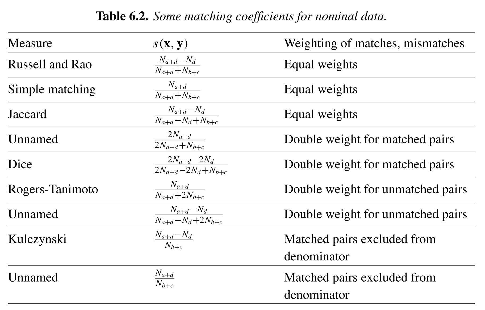


 
* For more details, see [GAN, Guojun, MA, Chaoqun, et WU, Jianhong. Data clustering: theory, algorithms, and applications. Society for Industrial and Applied Mathematics, 2020.](https://book4you.org/book/716744/c8c51f)
\pagebreak
 
# Gower’s dissimilarity
* Gower’s coefficient is a dissimilarity measure specifically
designed for handling mixed attribute types or variables.
* See: GOWER, John C. A general coefficient of similarity and some of its properties. _Biometrics_, 1971, p. 857-871.
* The coefficient is calculated as the weighted average of attribute contributions.
* Weights usually used only to indicate which attribute values could actually be compared meaningfully.
* The formula is:
$$
d(\mathbf{x},\mathbf{y})=\frac{\sum_{j=1}^m w_j \delta(x_j,y_j)}{\sum_{j=1}^m w_j}.
$$
* The wheight $w_j$  is put equal to $1$ when both measurements $x_j$ and $y_j$ are nonmissing, 
* The number $\delta(x_j,y_j)$ is the contribution of the $j$th measure or variable to the dissimilarity measure.
* If the $j$th measure is nominal, we take  
$$
\delta(x_j,y_j)\equiv \begin{cases}0,
\text{ if } x_j=y_j;\\1,\text{ if } x_j \neq y_j.\end{cases}
$$
*  If the $j$th measure is  interval-scaled, we take instead: 
$$
\delta(x_j,y_j)\equiv \frac{|x_j-y_j|}{R_j},
$$
where $R_j$ is the range of variable $j$ over the available data.


* Consider the following data set:


Data from: [Struyf, A., Hubert, M., & Rousseeuw, P. (1997). Clustering in an object-oriented environment. _Journal of Statistical Software_, _1_(4), 1-30](https://www.jstatsoft.org/article/view/v001i04).


 
* The dataset contains 18 flowers and 8 characteristics:
1. Winters: binary, indicates whether the plant may be left in the garden when it freezes.
2. Shadow: binary, shows whether the plant needs to stand in the shadow.
3. Tubers (Tubercule): asymmetric binary, distinguishes between plants with tubers and plants that grow in any other way.
4. Color: nominal, specifies the flower’s color (1=white, 2=yellow, 3= pink, 4=red, 5=
blue).
5. Soil: ordinal, indicates whether the plant grows in dry (1), normal (2), or wet (3) soil.
6. Preference: ordinal, someone’s preference ranking, going from 1 to 18.
7. Height: interval scaled, the plant’s height in centimeters.
8. Distance: interval scaled, the distance in centimeters that should be left between the plants.
 * The dissimilarity between Begonia  and Broom (Genêt) can be calculated as follows:
 

*Begonia*


*Genêt*


```{r, message = FALSE}
library(cluster)
library(dplyr)
data <-flower %>% 
rename(Winters=V1,Shadow=V2,Tubers=V3,Color=V4,Soil=V5,Preference=V6,Height=V7,Distance=V8) %>%
mutate(Winters=recode(Winters,"1"="Yes","0"="No"),
      Shadow=recode(Shadow,"1"="Yes","0"="No"),
      Tubers=recode(Tubers,"1"="Yes","0"="No"),
      Color=recode(Color,"1"="white", "2"="yellow", "3"= "pink", "4"="red", "5"="blue"),
      Soil=recode(Soil,"1"="dry", "2"="normal", "3"= "wet")
      ) 
row.names(data)=c("Begonia","Broom","Camellia","Dahlia","Forget-me-not","Fuchsia",
 "Geranium", "Gladiolus","Heather","Hydrangea","Iris","Lily","Lily-of-the-valley",
 "Peony","Pink Carnation","Red Rose","Scotch Rose","Tulip")
  
```


```{r,result = 'asis'}
res=lapply(data,class)  
res=as.data.frame(res)
res[1,] %>% 
knitr::kable()
```

```{r}
flower[1:2,]
```

```{r}
max(data$Height)-min(data$Height)
max(data$Distance)-min(data$Distance)
```


$$
\frac{|1-0|+|0-1|+|0-1|+1+|1-3|/2+|3-15|/17+|150-25|/180+|50-15|/50}{8}\approx 0.8875408
$$
 
# Daisy function


[Cluster package description available at this link](https://www.google.com/search?q=daisy+package+r&oq=daisy+&aqs=chrome.1.69i57j35i19i39j35i39j69i59j46i67i433.4466j0j7&client=tablet-android-samsung-nf-rev1&sourceid=chrome-mobile&ie=UTF-8).


```{r, message= F, echo=T,warning=F }
library(cluster)
(abs(1-0)+abs(0-1)+abs(0-1)+1+abs(1-3)/2+abs(3-15)/17+abs(150-25)/180+abs(50-15)/50)/8
dist<-daisy(data[,1:8],metric = "Gower")
as.matrix(dist)[1:2,1:2]
```


# More on distance matrix computation


* We use a subset of the data by taking 15 random rows among the 50 rows in the data set.
* We are using the function sample().
* We standardize the data using the function scale().


```{r,results='asis', echo = TRUE, eval=TRUE, warning=FALSE, message=FALSE}
stargazer(USArrests,header=TRUE, type='html',summary=FALSE,digits=1)
```


```{r,results='asis', echo = TRUE, eval=TRUE, warning=FALSE, message=FALSE}
set.seed(123)
ss <- sample(1:50,15) 
df <- USArrests[ss, ] 
df.scaled <- scale(df) 
stargazer(df.scaled,header=TRUE, type='html',summary=FALSE,digits=1)

```


* The R functions for computing distances.
1. dist() function accepts only numeric data.
2. get_dist() function [factoextra package] accepts only numeric data. it supports correlation-based distance measures.
3. daisy() function [cluster package] is able to handle other variable types (nominal, ordinal, ...). 
* Remark: All these functions compute distances between rows of the data.
* Remark: If we want to compute pairwise distances between variables, we must transpose the data to have variables in the rows.

* We first compute Euclidian distances

```{r,results='asis', echo = TRUE, eval=TRUE, warning=FALSE, message=FALSE}
dist.eucl <- dist(df.scaled, method = "euclidean",upper = TRUE)


stargazer(as.data.frame(as.matrix(dist.eucl)[1:3, 1:3]),header=TRUE, type='html',summary=FALSE,digits=1)


round(sqrt(sum((df.scaled["New Mexico",]-df.scaled["Iowa",])^2)),1)
round(sqrt(sum((df.scaled["New Mexico",]-df.scaled["Indiana",])^2)),1)
round(sqrt(sum((df.scaled["Iowa",]
-df.scaled["Indiana",])^2)),1)

```


* We also compute correlation based distances.

```{r,message=F}
library("factoextra")
dist.cor <- get_dist(df.scaled, method = "pearson")
round(as.matrix(dist.cor)[1:3, 1:3], 1)
round(1-cor(df.scaled["New Mexico",],df.scaled["Iowa",]),1)
round(1-cor(df.scaled["New Mexico",],df.scaled["Indiana",]),1)
round(1-cor(df.scaled["Iowa",],df.scaled["Indiana",]),1)

```

 
 

# Visualizing distance matrices
* A simple solution for visualizing the distance matrices is to use the function fviz_dist() [factoextra package].  
* Other specialized methods will be  described later on.

```{r}
library(factoextra)
fviz_dist(dist.eucl)
```


# Partitioning Clustering

* Partitioning clustering are clustering methods used to classify observations within a data set, into multiple groups based on their similarity.
* The algorithms require the analyst to specify the number of clusters to be generated.
*  We describe the commonly used partitioning clustering, including:
1. K-means clustering (MacQueen, 1967), in which, each cluster is represented by the center or means of the data points belonging to the cluster. The K-means method is sensitive to anomalous data points and outliers.
2. K-medoids clustering or PAM (Partitioning Around Medoids, Kaufman & Rousseeuw, 1990), in which, each cluster is represented by one of the objects in the cluster. PAM is less sensitive to outliers compared to k-means.
3. CLARA algorithm (Clustering Large Applications), which is an extension to PAM adapted for large data sets. 


# K-Means Clustering

* The description of the algorithm is based on:
* HARTIGAN, John A. _Clustering algorithms_. John Wiley & Sons, Inc., 1975.
* The data used by the author are provided below.
 
* The principal nutrients in meat, fish, and fowl are listed.
* Recall that 1oz= 28.34952g. 
* Estimated daily dietary allowances are: food energy (3200 
cal), protein (70 g), calcium (0.8 g), and iron (10 mg).
* Table 4.2 convents the variables (with the exception of Fat) in percentage of food delivery.


{width="60%", height="150px"}


* For e.g., the first (BB) ligne is obtained in the following way: 
* $340/3200=11\%\text{(Food Energy)}$. 
* $20/70=29\%\text{(Protein)}$.
* ${0.009}/{0.8}=1\%\text{ (Calcium)}$.
* ${2.6}/{10}= 26\%\text{ (Iron)}$.
* An argument could be made that iron is less important than calories or protein and so should be given less weight or ignored entirely.
* There are $n$ objects and $k$ clusters, $k\leq n$.
* Our purpose is to partition the $n$ objects (here  foods) so that objects within clusters are close and objects in different clusters are distant.
* Each cluster contains at least one object and each object belongs to only one cluster. 
* There is a very large number of possible partitions.

# Exercice 11
What is the number of possible partitions?


# K-Means
*  The discordance between the data and a given partition is denoted by $e$.
* We use the technique of local optimization.
* A neighborhood of partitions is defined for each ption.
* Starting from an initial partition, search through a set of partitions at each step.
* Move from the partition to a partition in its neighborhood for which $e$ is minim.
* If the neighborhoods are very large, it is cheaper computationally to move to the first partition discovered in the neighborhood where $e$ is reduced from its present value.
* A number of stopping rules are possible.
* For example, the search stops when $e$ is not reduced by movement to the neighborhood.
* The present partition is locally optimal in that it is the best partition in its neighborhood.
* Consider partitions of the five  ($n=5$) beef foods $\{\text{BB, BR,BS,BC,BH}\}$ into three clusters ($k=3$).
* Totally, there are 25 such partitions.

```{r,warning=FALSE,message=FALSE}
library(gmp)
Stirling2(5,3)
```

* A plausible neighborhood for a partition is the set of partitions obtained by transferring an object from one cluster to another.

* For the partition (BB BR) (BS) (BC BH), the neighborhood consists of the following ten partitions:

1. (BR) (BB BS) (BC BH)
2. (BR) (BS) (BB BC BH) 
3. (BB) (BR BS) (BC BH) 
4. (BB) (BS) (BR BC BH) 
5. (BB BR BS) O (BC BH) 
6. (BB BR) O (BS BC BH) 
7. (BB BR BC) (BS) (BH)
8. (BB BR) (BS BC) (BH) 
9. (BB BR BH) (BS) (BC) 
10. (BB BR) (BS BH) (BC)

# K-Means Algorithm
* Let $\mathbf{x}_i\equiv (x_i^1,\cdots,x_i^m)$ the vector of  values for the object $i$, $i=1,\cdots ,n.$
* The variables are assumed scaled.
* The partition has   $k$ disjoint clusters: $C_1,\cdots,C_k$, which are the indices of the objects in the various clusters.
* Let $n_l$ be the number of objects in cluster $C_l$.
* Each of the $n$ objects lies in just one of the $k$ clusters.
* Note that $\sum_{l=1}^k n_l=n$.
* The vector of means over the objects in cluster $C_l$ is denoted by $\bar{\mathbf{x}}_{l}$, with
$$
\bar{\mathbf{x}}_{l}\equiv\frac{1}{n_l}\sum_{i\in C_l}\mathbf{x}_{i}=(\bar{x}_l^1,\cdots,\bar{x}_l^m),\:l=1,\cdots, k,
$$
where 
$$
\bar{x}_l^j\equiv \frac{\sum_{i\in C_l}x_i^{j}}{n_l},\:j=1,\cdots, m; \:l=1,\cdots,k.
$$
* The distance between the object $j$ and the cluster $l$ is $d(\mathbf{x}_i,\bar{\mathbf{x}}_l)$, where $d$ is taken to be the Euclidian distance
$$
d(\mathbf{x}_i,\bar{\mathbf{x}}_l)=||\mathbf{x}_i-\bar{\mathbf{x}}_l||=\bigg[\sum_{j=1}^m(x_i^j-\bar{x}_l^j)^2\bigg]^{1/2},\:i=1,\cdots,m;\:l=1,\cdots,k.
$$ 
where $||\mathbf{\cdot}||$ is the Euclidian norm.

*  The error of the partition is taken to be  

$$
e=
\sum_{l=1}^{k}\sum_{i\in C_l}
||\mathbf{x}_i-\bar{\mathbf{x}}_l||^2.
$$

* Alternatively, we have
$$
e=\sum_{i=1}^{n}\sum_{j=1}^m||\mathbf{x}_i-\bar{\mathbf{x}}_{l(j)}||^2,
$$

where $l(i)$ is the index of the cluster of object $i$.

* The general procedure is to search for a partition with a small error $e$ by moving cases from one cluster to another.
* The search ends when no such movement reduces $e$.
* **STEP 1**. Assume initial clusters. Compute the cluster means $\bar{\mathbf{x}}_l$ and the initial error $e$.
* **STEP 2**. For the first object, compute for every cluster $l$ 

$$
\Delta e=
\frac{n_ld^2(\mathbf{x}_1,\bar{\mathbf{x}}_l)}{n_l+1}-\frac{n_{l(1)}d^2(\mathbf{x}_1,\bar{\mathbf{x}}_{l(1)})}{n_{l(1)}-1},\:l=1,\cdots, k,\:l\neq l(1).
$$

* It corresponds to the error variation in transferring the first object from cluster $l(1)$ to which it belongs to cluster $l$.
* If the minimum of this quantity over all $l\neq l(1)$ is negative, transfer the first case from cluster $l(1)$ to this minimal $l$.
* Adjust the cluster means of $l(1)$ and the minimal $l$ and add the error variation (which is negative) to $e$.
* **STEP 3**. Repeat STEP 2 for each object $i$ such that $2\leq i \leq n$.
* **STEP 4**. lf no movement of an object from one cluster to another occurs for any case, stop. Otherwise, return to STEP 2.


# Exercice 12
Prove that the error variation is indeed given by: 

$$
\Delta e=
\frac{n_ld^2(\mathbf{x}_1,\bar{\mathbf{x}}_l)}{n_l+1}-\frac{n_{l(1)}d^2(\mathbf{x}_1,\bar{\mathbf{x}}_{l(1)})}{n_{l(1)}-1},\:l=1,\cdots, k,\:l\neq l(1).
$$

# K-MEANS APPLIED TO FOOD NUTRIENT DATA

* Only the first eight foods will be considered.
* Only three variables, food energy, protein, and calcium as a percentage of recommended daily allowances are used.
* The eight foods $(m=8)$ are partitioned into three clusters ($k=3$).

# Exercice 13

* Explain in details the k-means algorithm based on the following pages of Hartigan (1975).

 

 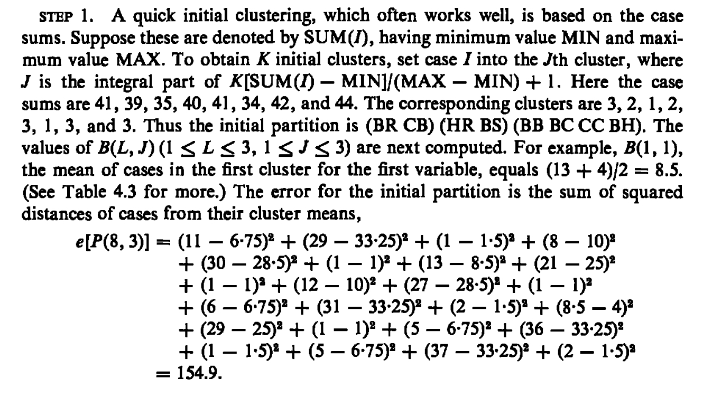
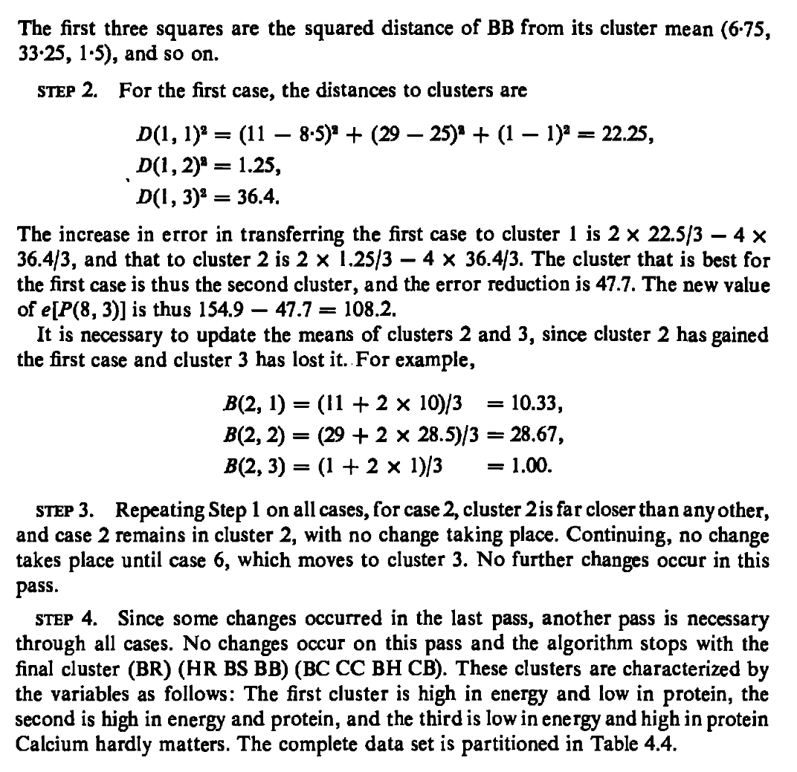


```{r}
#library("cluster.datasets")
#write.csv(rda.meat.fish.fowl.1959,"Hartigandat%a1.csv")
df<-read.csv("Hartigandata1.csv")
print(df)
df<-df[1:8,c(3,4,6)]
df
```

```{r}
# The data set contains some errors 
df[3,1]<-13 # Error in line 3
df[6,1]<-4 # Error at line 6
df[7,3]<-1 # Error at line 7
df
rownames(df)<-c("BB","HR","BR","BS","BC","CB","CC","BH")
df
colnames(df)<-c("Energy","Protein","Calcium")
df
``` 
# More on kmeans() output


```{r}
km.res<-kmeans(df[1:8,],3)
km.res$cluster
km.res$centers
km.res$totss
sum((df[1:8,]$Energy-mean(df[1:8,]$Energy))^2)+
sum((df[1:8,]$Protein-mean(df[1:8,]$Protein))^2)+
sum((df[1:8,]$Calcium-mean(df[1:8,]$Calcium))^2)
7*var(df[1:8,]$Energy)+7*var(df[1:8,]$Protein)+7*var(df[1:8,]$Calcium)
km.res$withinss
km.res$tot.withinss
km.res$betweenss
km.res$size
km.res$iter
```

# Exercice 14

* Produce a heatmap for the data by rearranging the lines according to the found clusters (k=3).


# Exercice 15

* Produce the Table 4.4 of Hartigan (1975).

 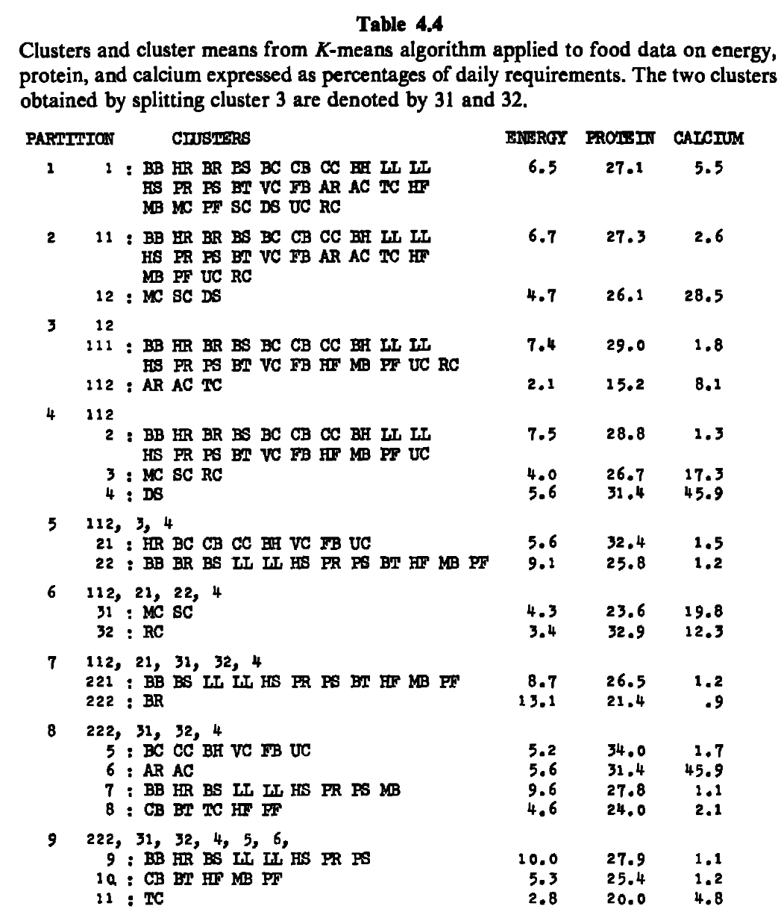

# Exercice 16

* Use ggplot2 to draw an x-y plot with the number of clusters on the x-axis and the error on the y-axis.


**Remark:** The location of a knee is generally considered as an appropriate number of clusters.


 
# Visualizing k-means clusters

* The results are visualized using fviz_cluster() function.
* It draws a scatter plot of data points colored by cluster numbers.
* If the data contains more than 2 variables, the Principal Component Analysis (PCA) algorithm is used to reduce the dimensionality of the data.
* The first two principal dimensions are used to plot the data.

```{r}
library(ggplot2)
library(factoextra)
fviz_cluster(km.res, df, ellipse.type = "norm")
fviz_cluster(km.res, data = df[1:8,],
palette = c("#2E9FDF", "#00AFBB", "#E7B800"),
ellipse.type = "euclid", # Concentration ellipse
star.plot = TRUE, # Add segments from centroids to items
repel = TRUE, # Avoid label overplotting (slow)
ggtheme = theme_minimal()
)
```
```{r}
pca=prcomp(df[1:8,], scale = TRUE)
summary(pca)

```


# More on PCA

```{r}
data(decathlon2)
decathlon.active <- decathlon2[1:23, 1:10]
res.pca <- prcomp(decathlon.active, scale = TRUE)
summary(res.pca)
fviz_pca_biplot(res.pca)
```


# Silouhette

* Assume the data are clustered into $k$ clusters.
* For $i=1,\cdots,n$, let:
$$
a_i=\frac{1}{n_{l(i)}-1}\sum_{i^\prime \in i\in C_{l(i)}\setminus\{i\}}d(i,i^\prime),
$$
be the mean distance between $i$ and all the points of the same cluster.
* If $n_{l(i)}=1$, we set $a_i=0$.
* It is  interpreted as a measure of how well $i$ is assigned to its cluster (smaller the value, better is the assignment).
* Let also
$$ b_i=\min_{l\neq l(i)}{\frac {1}{|n_{l}|}}\sum_{i^\prime\in C_l}d(i,i^\prime),$$
be the "neighboring cluster" of  $i$.
* We now define a  *silhouette* of $i$ as 
 $$ s_i=\frac {b_i-a_i}{\max(a_i,b_i)} \text{ if }n_{l(i)}>1,$$
and
$$
s_i=0\text{ if }n_{l(i)}=1.
$$
* From the above definition it is clear that
$$ -1\leq s_i\leq 1$$
* For  $s_i$ to be close to 1 we require  $a_i<<b_i$.
* If $s_i$ is close to $-1$, $i$ is more appropriately clustered in its neighbouring cluster.
* An $s_i$ near zero means that the $i$ is on the border of two natural clusters.

# Exercice 17
* We are using the data of the paper which introduces the **Silouhette** method some years ago: [ROUSSEEUW, Peter J. Silhouettes: a graphical aid to the interpretation and validation of cluster analysis. Journal of computational and applied mathematics, 1987, vol. 20, p. 53-65.](https://booksc.org/book/3006616/528309).

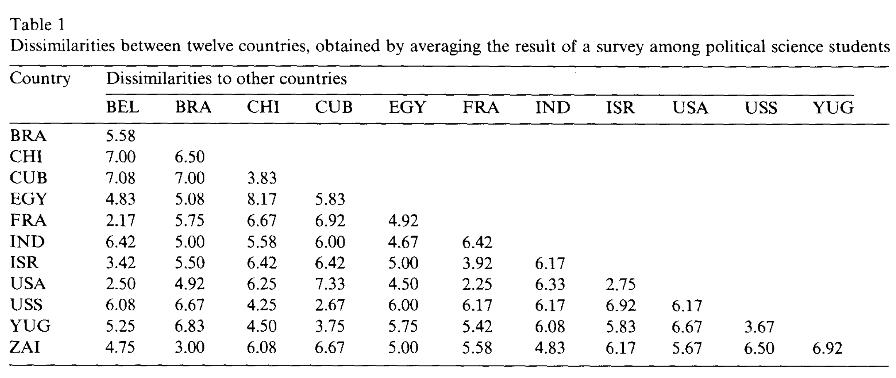
* The author obtain the following two figures.

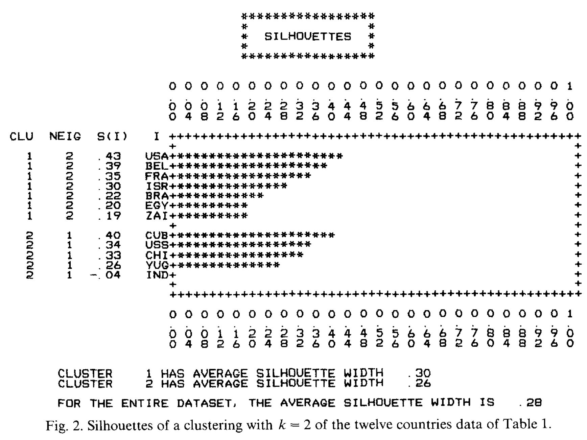

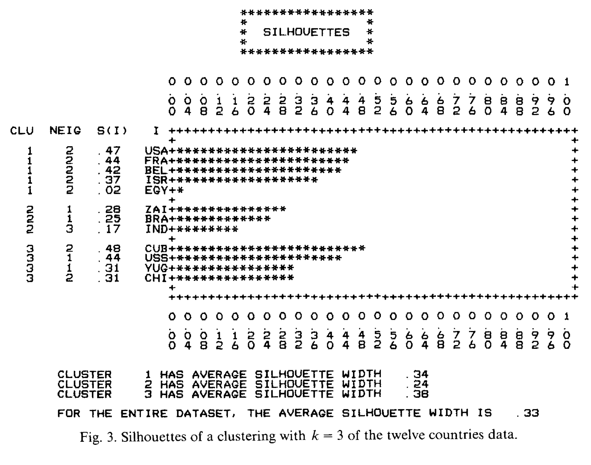

* Your task is to produce the same figures using modern dataviz tools.
* What did you learn from theses graphs?

# Exercice 18 

* Provide a silouhette graph for the Hartigan (75) data

# Exercice 19

* Provide a k-means clustering analysis of the US Arrest data

# Partitioning Around Medoids (PAM, k-medoids))

* The algorithm used in the program PAM search for $k$ representative objects among the objects of the data set.
* These objects should represent various aspects of the structure of the data.
* In the PAM algorithm the representative objects are the so-called medoids of the clusters.
* After finding a set of $k$ representative objects, the $k$ clusters are constructed by assigning each object of the data set to the nearest representative object.
* To illustrate the PAM  algorithm, consider the data set containing 10 objects ($n = 10$) and two variables ($m = 2$).
* Suppose the data set must be divided into two subsets or clusters ($k = 2$).
* The  algorithm first considers possible choices of two representative objects and then constructs the clusters around these representative objects.

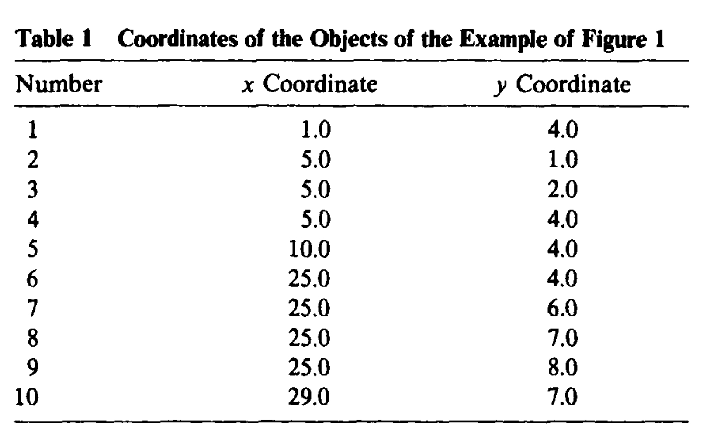


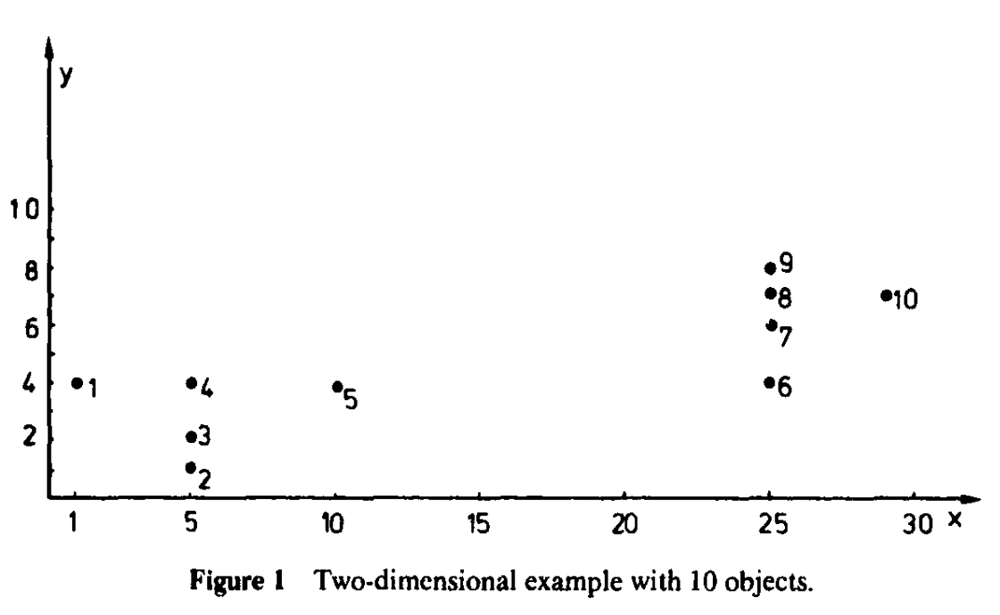


* As an example, suppose objects 1 and 5 are the selected representative objects.
* In Table 2 the dissimilarities (Euclidean distance) from each of the objects to the two selected objects are given, as well as the smallest of these two dissimilarities and the corresponding representative object. 
* The average dissimilarity is 9.37.

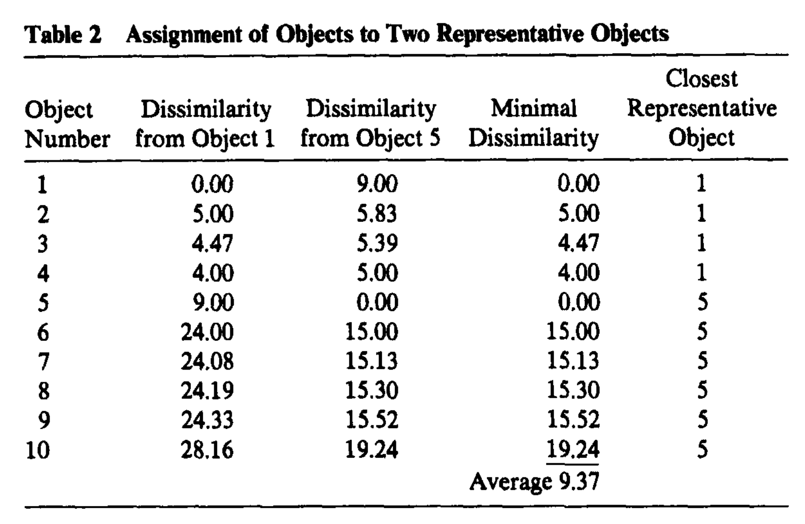

* In Table 3 the assignment is carried out for the case objects 4 and 8 are selected as representative objects.

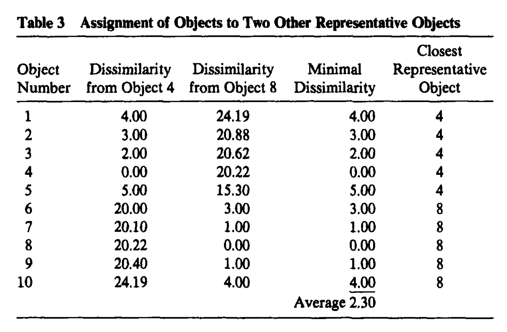

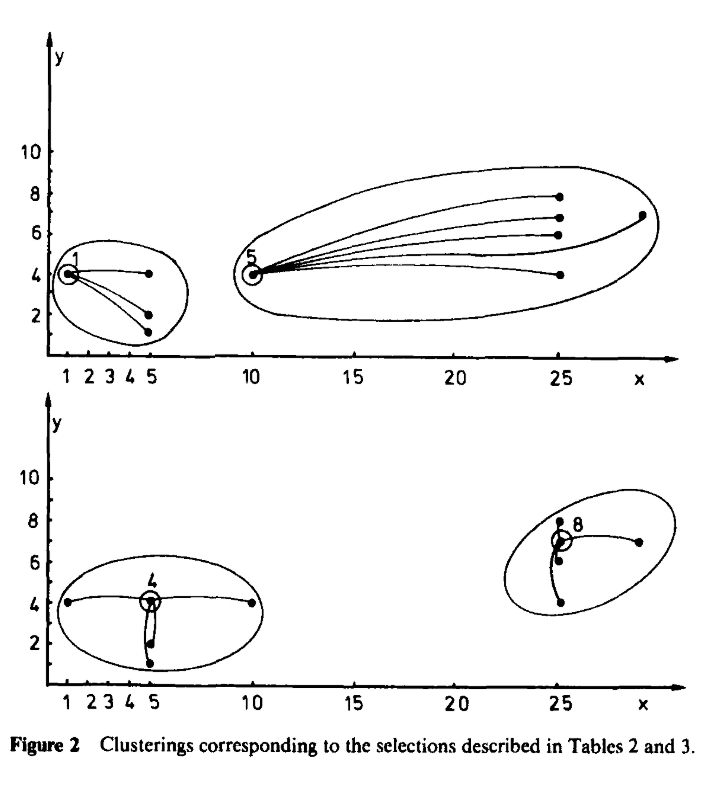

* The average dissimilarity for the case objects 4 and 8 are selected is 2.30, which is considerably less than the value of 9.37, found when 1 and 5 were the representative objects.
* Alternatively a PAM program can be used by entering a matrix of dissimilarities between objects.
* The algorithms are rather sophisticated and are not detailed here.


